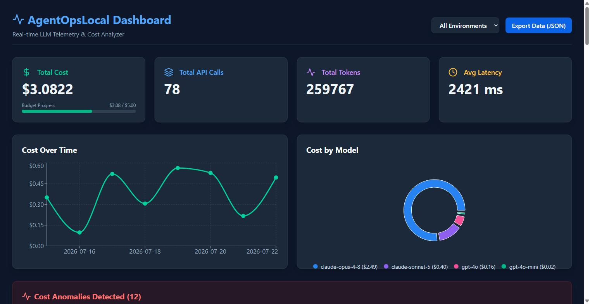

<div align="center">

# AgentOpsLocal

### Self-hosted LLM observability, cost tracking & telemetry for AI agents

**A zero-config, private, local-first dashboard that tracks token usage, latency, and cost across every LLM call your AI agents make — OpenAI, Anthropic, and any other provider.**

[](./LICENSE)
[](https://www.python.org/)
[](https://fastapi.tiangolo.com/)
[](https://react.dev/)
[](https://www.docker.com/)
[](./CONTRIBUTING.md)

</div>

---

## What is AgentOpsLocal?

As developers build complex multi-agent workflows, tracing **what prompts were sent, how long each LLM call took, and how many tokens (and dollars) it cost** becomes impossible to manage across standard logs.

**AgentOpsLocal** is a standalone telemetry sink for AI agents. Route your LLM calls through a single ingestion endpoint and get a **real-time dashboard** with cost analytics, latency metrics, anomaly detection, and full prompt/response traces — grouped by task, session, agent, and environment.

It runs entirely on your machine. No accounts, no cloud, no data leaving your laptop.

> **Why local-first?** LLM telemetry contains your prompts, responses, and proprietary logic. AgentOpsLocal keeps all of it on your infrastructure — a self-hosted alternative to SaaS observability platforms, ideal for local development, prototyping, and privacy-sensitive workloads.

## Table of Contents

- [Key Features](#key-features)
- [Screenshots](#screenshots)
- [Tech Stack](#tech-stack)
- [Quickstart (Docker)](#quickstart-docker)
- [Local Development](#local-development)
- [How It Works](#how-it-works)
- [Integrating Your Agent](#integrating-your-agent)
- [API Reference](#api-reference)
- [Configuration](#configuration)
- [Running Tests](#running-tests)
- [Roadmap](#roadmap)
- [Contributing](#contributing)
- [License](#license)

## Key Features

| Feature | Description |
| --- | --- |
| 📊 **Real-time dashboard** | Live cost, token, latency, and call-count KPIs that auto-refresh every 5 seconds. |
| 💰 **Cost analytics** | Spend broken down by model, task, and agent, plus a cost-over-time trend chart. |
| 🚨 **Anomaly detection** | Automatically flags calls that cost 2× (or 5×) more than the average for their task. |
| 🧵 **Session traces** | Reconstruct a full multi-step agent run as an ordered timeline of LLM calls. |
| 🎯 **Environment filtering** | Slice all analytics by `dev`, `staging`, or `prod`. |
| 🛑 **Daily budget guardrail** | Optionally reject ingestion once a configurable daily spend limit is exceeded. |
| 📦 **One-file JSON export** | Export all telemetry for backup, auditing, or fine-tuning datasets. |
| 🔌 **Provider-agnostic** | Works with OpenAI, Anthropic, or any LLM — you send a simple JSON payload. |
| 🔒 **100% local & private** | FastAPI + SQLite. Zero external dependencies at runtime. Your data never leaves your machine. |

## Screenshots



## Tech Stack

- **Backend:** [FastAPI](https://fastapi.tiangolo.com/) · [SQLAlchemy 2.0](https://www.sqlalchemy.org/) · [Pydantic v2](https://docs.pydantic.dev/) · [Uvicorn](https://www.uvicorn.org/)
- **Database:** SQLite by default — swappable to PostgreSQL via a single environment variable
- **Frontend:** [React 18](https://react.dev/) · [Vite](https://vitejs.dev/) · [Tailwind CSS](https://tailwindcss.com/) · [Recharts](https://recharts.org/)
- **Tooling:** Docker & Docker Compose · pytest · GitHub Actions CI

## Quickstart (Docker)

The fastest way to run the full stack. Requires [Docker Desktop](https://www.docker.com/products/docker-desktop/).

```bash
git clone https://github.com/manijose1919/agent-ops-local.git
cd agent-ops-local
docker compose up --build
```

On Windows you can instead double-click **`run.bat`**, which starts Docker Desktop if needed and brings the stack up.

Once running:

| Service | URL |
| --- | --- |
| 📊 Dashboard | http://localhost:5173 |
| 🔌 Backend API | http://localhost:8000 |
| 📚 Interactive API docs (Swagger) | http://localhost:8000/docs |

To stop: `docker compose down`.

## Local Development

Prefer running the backend and frontend directly (with hot reload)?

### Prerequisites

- Python 3.11+
- Node.js 18+

### 1. Backend (FastAPI)

```bash
# From the repository root
python -m venv .venv
source .venv/bin/activate        # Windows: .venv\Scripts\activate
pip install -r requirements.txt

uvicorn backend.main:app --reload --port 8000
```

The API is now live at http://localhost:8000 (docs at `/docs`). A local SQLite file `agent_ops.db` is created automatically on first run.

### 2. Frontend (React + Vite)

In a second terminal:

```bash
npm install
npm run dev
```

Open http://localhost:5173. The dashboard talks to the backend at `http://localhost:8000` by default (override with `VITE_API_BASE_URL`).

## How It Works

```
                          ┌──────────────────────────┐
   Your AI Agent          │      AgentOpsLocal        │
 ┌───────────────┐        │                           │
 │  LLM call      │  POST  │  FastAPI  ──►  SQLite     │
 │  (OpenAI /     ├───────►│  /api/v1/ingest           │
 │   Anthropic)   │  JSON  │                           │
 └───────────────┘        │       ▲                   │
                          │       │ REST (analytics)  │
                          │  ┌────┴──────────────┐    │
                          │  │  React Dashboard   │    │
                          │  │  (cost, latency,   │    │
                          │  │   traces, alerts)  │    │
                          │  └───────────────────┘    │
                          └──────────────────────────┘
```

1. Your agent finishes an LLM call and **POSTs a small JSON payload** to `/api/v1/ingest`.
2. FastAPI validates it, optionally enforces your **daily budget**, and stores it in SQLite. Calls are linked into **sessions** automatically when you supply a `session_id`.
3. The React dashboard polls the analytics endpoints and renders **live KPIs, charts, anomalies, and session traces**.

### Project Structure

```
agent-ops-local/
├── backend/                 # FastAPI application
│   ├── main.py              # App entrypoint, CORS, router wiring
│   ├── database.py          # SQLAlchemy engine/session (SQLite → Postgres swappable)
│   ├── models.py            # ORM models: AgentSession, APICall
│   ├── schemas.py           # Pydantic request/response schemas
│   └── routers/
│       ├── ingest.py        # POST /ingest, GET /calls
│       └── analytics.py     # summary, anomalies, export, session traces
├── src/                     # React + Vite dashboard
│   ├── App.jsx              # Dashboard UI (KPIs, charts, table, traces)
│   └── main.jsx
├── tests/                   # pytest backend tests
├── docker-compose.yml       # Full-stack orchestration
├── Dockerfile.backend
├── Dockerfile.frontend
└── requirements.txt
```

## Integrating Your Agent

Log a call from **any** language by POSTing to `/api/v1/ingest` whenever an LLM request completes.

### Python

```python
import requests

def log_llm_call(task_name, model, prompt, response, tokens, cost, latency_ms):
    requests.post("http://localhost:8000/api/v1/ingest", json={
        "task_name": task_name,      # e.g. "summarize_doc"
        "model": model,              # e.g. "gpt-4o"
        "provider": "openai",
        "prompt": prompt,            # string OR list of message dicts
        "response": response,
        "prompt_tokens": tokens["prompt"],
        "completion_tokens": tokens["completion"],
        "total_tokens": tokens["total"],
        "cost": cost,                # USD
        "latency_ms": latency_ms,
        "session_id": "run-abc123",  # optional — groups calls into a trace
        "environment": "dev",        # optional — dev | staging | prod
    })
```

> **Note:** the endpoint is `/api/v1/ingest` and the token field is `total_tokens` (not `/ingest` / `tokens_used`). Only `task_name`, `model`, `prompt`, and `response` are required; everything else is optional.

### Node.js

```javascript
await fetch("http://localhost:8000/api/v1/ingest", {
  method: "POST",
  headers: { "Content-Type": "application/json" },
  body: JSON.stringify({
    task_name: "generate_code",
    model: "claude-opus-4-8",
    provider: "anthropic",
    prompt: messages,
    response: completion,
    total_tokens: usage.total_tokens,
    cost: 0.0021,
    latency_ms: 842,
    session_id: "run-abc123",
  }),
});
```

## API Reference

Base URL: `http://localhost:8000`

| Method | Endpoint | Description |
| --- | --- | --- |
| `POST` | `/api/v1/ingest` | Ingest a single LLM call. Auto-creates the session if `session_id` is new. Returns `429` if the daily budget is exceeded. |
| `GET` | `/api/v1/calls` | List recent calls. Query: `skip`, `limit`, `env`. |
| `GET` | `/api/v1/analytics/summary` | Aggregated KPIs + breakdowns by model/task/agent + cost-over-time. Query: `env`. |
| `GET` | `/api/v1/analytics/anomalies` | Calls costing >2× their task average. Query: `env`. |
| `GET` | `/api/v1/analytics/export` | Download all telemetry as a JSON attachment. Query: `env`. |
| `GET` | `/api/v1/analytics/sessions/{session_id}` | Ordered timeline of all calls in a session. |

Full interactive documentation (request/response schemas, try-it-out) is auto-generated at **http://localhost:8000/docs**.

### `POST /api/v1/ingest` — request body

| Field | Type | Required | Description |
| --- | --- | --- | --- |
| `task_name` | string | ✅ | Logical task that triggered the call (e.g. `summarize_doc`). |
| `model` | string | ✅ | Model identifier (e.g. `gpt-4o`). |
| `prompt` | string / list / dict | ✅ | The prompt or message array sent to the model. |
| `response` | string | ✅ | The model's text response. |
| `provider` | string | — | e.g. `openai`, `anthropic`. |
| `session_id` | string | — | Groups calls into a session trace. |
| `agent_id` | string | — | ID of the autonomous agent making the call. |
| `environment` | string | — | `dev` (default), `staging`, or `prod`. |
| `prompt_tokens` / `completion_tokens` / `total_tokens` | int | — | Token counts (default `0`). |
| `cost` | float | — | Call cost in USD (default `0.0`). |
| `latency_ms` | float | — | Call latency in milliseconds (default `0.0`). |

## Configuration

Copy `.env.example` to `.env` and adjust as needed. All variables are optional — the defaults give you a working zero-config local setup.

| Variable | Default | Description |
| --- | --- | --- |
| `HOST` | `0.0.0.0` | Backend bind host. |
| `PORT` | `8000` | Backend port. |
| `DATABASE_URL` | `sqlite:///./agent_ops.db` | SQLAlchemy connection string. Set to a `postgresql://…` URL to use PostgreSQL. |
| `DAILY_BUDGET` | `0` (disabled) | Max USD spend per day. When `> 0`, ingestion returns `429` once exceeded, and the dashboard shows a budget progress bar. |
| `VITE_API_BASE_URL` | `http://localhost:8000` | Backend URL the frontend calls. |

## Running Tests

```bash
pip install -r requirements.txt
pytest tests/
```

The GitHub Actions workflow (`.github/workflows/main.yml`) runs the backend test suite and builds the frontend on every push and pull request.

## Roadmap

- [ ] **Official Python SDK** — auto-instrument OpenAI/Anthropic clients so telemetry is captured with one `init()` call and no code changes.
- [ ] **Server-side pricing engine** — compute cost from token counts and a model price table, so the numbers are authoritative.
- [ ] **API-key authentication** — secure the ingestion endpoint for shared/team deployments.
- [ ] **Batch ingestion** — a `/ingest/batch` endpoint for high-throughput agents.
- [ ] **Latency percentiles** — p50 / p95 / p99 alongside averages.
- [ ] **Error & retry tracking** — capture failed calls, error types, and retries.

Have an idea? [Open an issue](https://github.com/manijose1919/agent-ops-local/issues).

## Contributing

Contributions are welcome! Please read [CONTRIBUTING.md](./CONTRIBUTING.md) for local setup, branch, and pull-request guidelines.

## License

Distributed under the MIT License. See [`LICENSE`](./LICENSE) for details.

---

<div align="center">
<sub>Built for developers building AI agents. If AgentOpsLocal is useful to you, consider starring the repo ⭐</sub>
</div>
